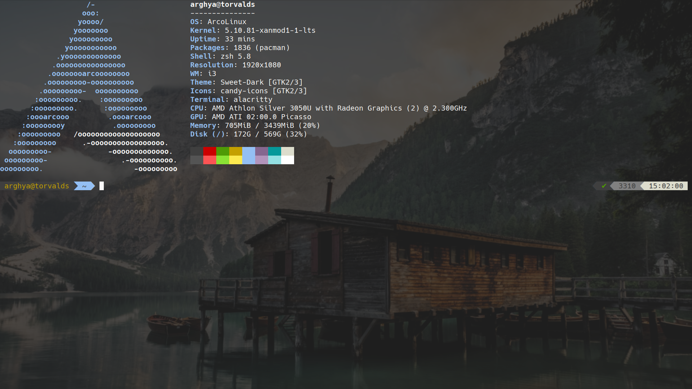
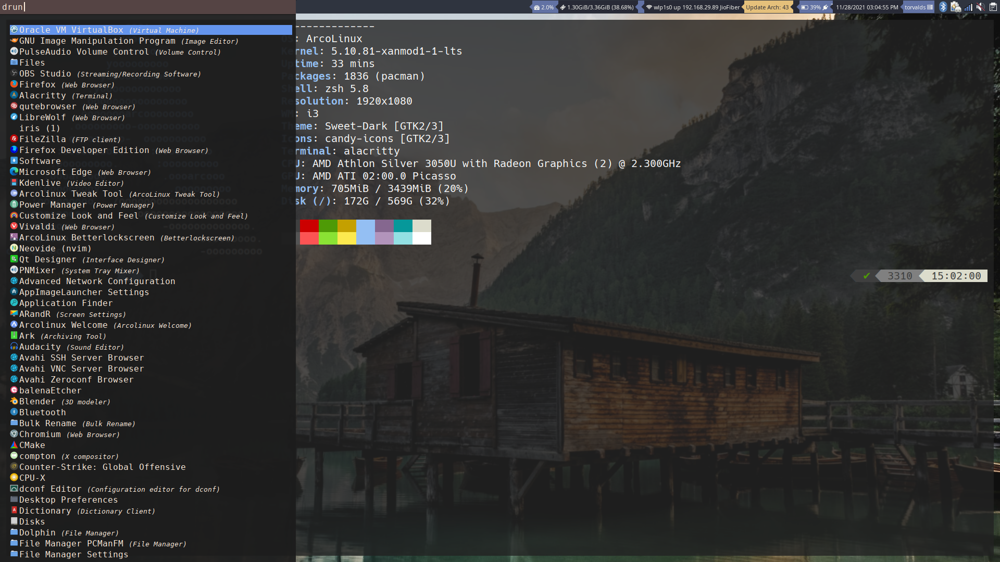
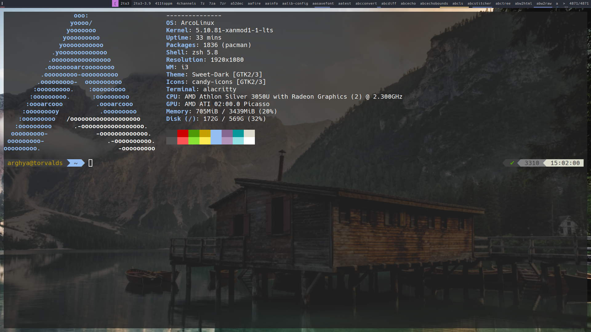

## Peaceful-i3
### Clean and Keyboard driven theme for [i3wm](https://i3wm.org/)

An almost desktop environment made with [i3wm](https://i3wm.org/) with a performant opiniated mouse/keyboard workflow to increase daily productivity and comfort.

[](./.assets/ss.png)

| Fullscreen   | Rofi Combo Panel | Dmenu   |
|:-------------:|:-------------:|:-------------:|
||||

## Installation

### 1) Get all the dependencies

#### Debian-Based

```
sudo apt install i3blocks i3status fonts-noto rofi volumeicon-alsa picom i3lock-fancy xclip qt5-style-plugins lxappearance xbacklight xfce4-screenshooter mate-power-manager network-manager-gnome policykit-1-gnome feh xfce4-clipman python3-pip -y

git clone git@github.com:maestrogerardo/i3-gaps-deb.git
cd i3-gaps-deb
./i3-gaps-deb
```

#### Arch-Based

```
yay -S i3-gaps i3blocks i3status rofi picom i3lock-fancy xclip ttf-roboto noto-fonts xfce4-screenshooter polkit-gnome lxappearance python-pip volumeicon  network-manager-applet xfce4-power-manager qt5-styleplugins papirus-icon-theme -y
```

#### Program list

- [i3-gaps](https://i3wm.org/) as the window manager
- [Rofi](https://github.com/DaveDavenport/rofi) and [dmenu-distrotube](https://gitlab.com/dwt1/dmenu-distrotube) for the app launchers
- [picom](https://github.com/yshui/picom) for the compositor (blur and animations)
- [i3lock](https://github.com/meskarune/i3lock-fancy) the lockscreen application
- [xclip](https://github.com/astrand/xclip) for copying screenshots to clipboard package
- [gnome-polkit] recommend using the gnome-polkit as it integrates nicely for elevating programs that need root access
- [Materia](https://github.com/nana-4/materia-theme) as GTK theme - Arch Install: materia-theme debian: materia-gtk-theme
- [Papirus Dark](https://github.com/PapirusDevelopmentTeam/papirus-icon-theme) as icon theme Universal Install: wget -qO- https://git.io/papirus-icon-theme-install | sh
- [lxappearance](https://sourceforge.net/projects/lxde/files/LXAppearance/) to set up the gtk and icon theme
- (Laptop) [xbacklight](https://www.x.org/archive/X11R7.5/doc/man/man1/xbacklight.1.html) for adjusting brightness on laptops (disabled by default)
- [flameshot](https://flameshot.org/) my personal screenshot utility of choice, can be replaced by whichever you want, just remember to edit the apps.lua file
- [pnmixer](https://github.com/nicklan/pnmixer) Audio Tray icon that is in debian repositories and is easily installed on arch through AUR.
- [network-manager-applet](https://gitlab.gnome.org/GNOME/network-manager-applet) nm-applet is a Network Manager Tray display from GNOME.
- [mate-power-manager](https://docs.xfce.org/xfce/xfce4-power-manager/start) XFCE4's power manager is excellent and a great way of dealing with sleep, monitor timeout, and other power management features.

### 2) Run the install script

**Installation**

```
git clone https://github.com/arghyagod-coder/peaceful-i3
cd peaceful-i3 && bash install.sh
```


